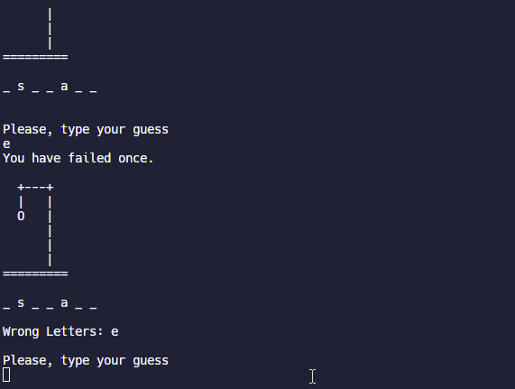

# Hangman Game 🎮
Welcome to Hangman! This is a classic word-guessing game where you try to figure out the hidden word before the hangman gets completed. Have fun playing and sharpening your vocabulary skills! 😉

## Preview 🖼️

## How to Play 🕹️
 - If you cloned the repository:

    -  Run `ruby main.rb` in your terminal.

- If you're using [Replit](https://replit.com/@blondymartinezm/Ruby-Hangman):

  - Fork the project.
  - Click on "Run" to start the game.

# Features 🌟
 - Save and load your progress using YAML.
 - Fun and interactive gameplay.
 - A diverse range of words to keep you engaged.
